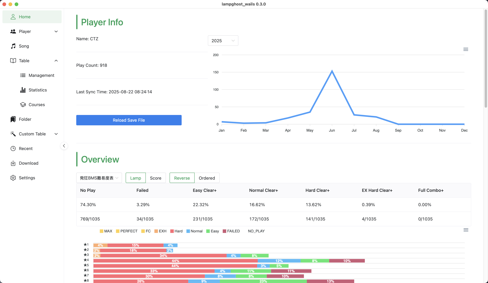

# LampGhost

English | [简体中文](./README.zh-CN.md)

## What is LampGhost?

`LampGhost` is an **offline** and **cross-platform** `beatoraja` save file viewer, favorite folder manager and provides lamp diff view . It supports:

- `I18n`:`English` and `zh-CN` are supported currently
- `Multiple User`: You can load your friends' save file and view their scores
- `Time Machine`: Compare lamp status between you and your friends, and could even "turn back" your friend's save file time(Suppose your friend is already ^^, using `LampGhost` allows you comparing the lamp status the moment that your friend achived ★5). And even "back port" the data into beatoraja
- `Favorite Folder`: Customize favorite folder and import it as a difficult table in `beatoraja`(tip: You can reload table by pressing F2 in game). More specifically, import `http://127.0.0.1:7391/table/lampghost.json` in `beatoraja` while keep `LampGhost` opening
- `Custom Difficult Table`: Customize your own difficult table and export, share, or deploy to static website
- `Download Missing BMS`: LampGhost implements the integration with some BMS download servers, you can download the missing BMS through LampGhost or supply missing bms based on difficult tables

Because `LampGhost` is an **offline** tool, therefore:

- No need of an `ir.jar` file for connecting a centerialized server. Therefore won't be unusable due to server is down
- If you want to compare your friends' save file, you need to ask them and handle them manually, which could be a tedious task
- It's always here, when you want to see your progress, the only thing you need to do is pressing the sync button
- There might be a risk for some breaking changes that you have to remove `LampGhost`'s database file and have a clean start

> [!warning]
>
> Data is invaluable, backup your save file is highly recommanded. Although `LampGhost` would only **read** your save file but never **modify** it, but there still be some rare bug that ruin your save file

## How to download and use LampGhost?

Grab an executable at `Release` page, then double-click it. This should be working for `Windows` and `Linux`.

## Build from scratch

- Install [wails](https://github.com/wailsapp/wails)
- `wails build`

## Attentions

First of all, you need to import some difficult tables just like `beatoraja` to make the most features work.

Secondly,this project is still at early demo phase, you might encounter some mystery problem(Don't worry, won't ruin your save file most likely). You could delete the whole `LampGhost` data folder to have a clean restart:

For `Windows` user it's located at `%USERPROFILE%\.lampghost_wails`, for `Linux/OSX` user is `$HOME/.lampghost_wails`

### Unfortunate LR2 users

LR2's database doesn't record much useful data so `LampGhost` can only provide partial support for LR2 users:

- LR2 users can view their lamps, but all features that are related to time are not useable for LR2 users. This is because LR2's score database file doesn't record when the record set. Also it's impossible to view recent activities since LR2 only records each song's best score but no play logs.
- Because LR2 doesn't provide a file like `songdata.db`, `LampGhost` provides the ability of scanning bms directories and building an equivalent of `songdata.db`. However, this is a very time-consuming task to do(it needs to scan every bms file on your disk). Currently, `LampGhost` only supports completely rebuild the file.
- You cannot add a LR2 user as a rival currently.

## Bugs reports and Advices

This project is made by my own(at least for now), so it's still very simple and biased. Any bug reports and advices are very welcomed!

## Special Thanks

- [@Yuntian](https://www.github.com/Yuntian52s): Providing ui design advices, without his selfless work `LampGhost` would still a be a very unfriendly tool
- [@Wriggle](https://www.github.com/wrigglebug): Providing bms download site [The Big Sister BMS Project](https://bms.wrigglebug.xyz/) and separate bms sabun download api.
- [@MaverickLong](https://www.github.com/MaverickLong): Providing bms download site [Konmai](https://616.sb/bms/download) and separate bms sabun download api.
- [@Sayaka](https://github.com/SayakaIsBaka): Providing bms preview site [BMS Score Viewer](https://github.com/SayakaIsBaka/bms-score-viewer)
- [@Chuang](https://github.com/chuang1213), yzy, yf and other early version testers
- [Wails](https://github.com/wailsapp/wails): This project is based on `wails` framework, and benefits a lot from its amazing hot reload time and easy mind model
