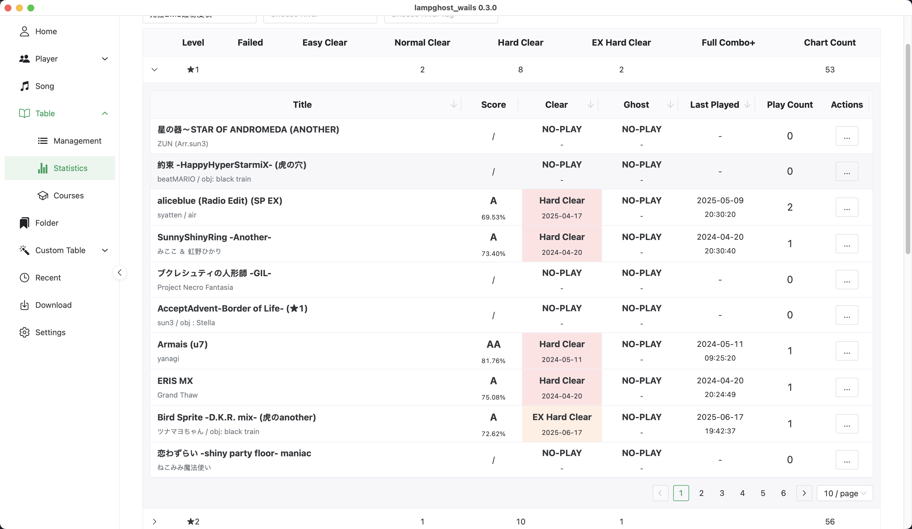

# LampGhost

[English](./README.md) | 简体中文

## 什么是 LampGhost?

`LampGhost`是一个**离线**并且**跨平台**的`beatoraja/LR2`存档查看，收藏夹管理以及点灯情况对比查看的工具。它支持以下功能：

- 国际化设置: 目前版本支持`English`和`简体中文`
- 多客户端支持：`LampGhost`虽然主要支持`Beatoraja`，但也对`LR2`用户提供有限的支持
- 多用户: 你可以导入你朋友的存档文件，并查看他们的点灯情况和历史
- "时间机器": `LampGhost`不仅可以对比你和你朋友的点灯情况，允许你"**退回**"你朋友的游戏记录（例如：你的朋友可能已经狂皆了，通过这个工具你可以对比你朋友在刚通过发狂五段时的点灯情况）。甚至是将数据"反向导入"到beatoraja中
- 自定义收藏夹: 并将你的收藏夹数据当作一个难度表导入到`beatoraja`中，可以在游戏内刷新收藏夹定义。具体地，在默认设置下**开启**`LampGhost`程序的同时在`beatoraja`中引入`http://127.0.0.1:7391/table/lampghost.json`即可
- 自定义难度表：自定义你自己的难度表，导出、分享甚至是部署到静态网站
- 下载缺失的BMS：LampGhost实现了一些BMS下载站的对接，你可以查看缺失的BMS并从这些站点直接下载BMS或者根据难度表来补全所有缺失的BMS
- 自动化：`LampGhost`会监控你的存档程序并且在游玩结束时自动增量同步你的存档信息

由于`LampGhost`是一个**离线**的存档查看工具，因此它:

- 不需要引入一个 ir.jar 文件，连接到一个中心化的服务器。不会因为服务器宕机而无法使用该工具
- 如果你想对比你朋友的存档，你需要找他们要存档文件并手动管理这些文件（以及更新！）
- 它永远就在这里，当你需要查看你的进度的时候，你只需要同步你最新的进度就可以了
- 可能会随着项目迭代导致有破坏性更新，你不得不清除你本地已有的数据

> [!warning]
>
> 数据无价，建议使用过程中对你的存档文件进行备份。尽管`LampGhost`只会**读取**你的存档文件而不会**修改**你的存档文件，但是可能会有非常罕见的 bug 破坏你的存档。

## 怎么下载使用 LampGhost?

在 Release 页下载可执行文件，双击打开即可

## 自行构建

- 下载 [wails](https://github.com/wailsapp/wails)
- `wails build`

## 注意事项

项目当前阶段还处于早期 demo，你可能会碰到一些莫名其妙的问题（但不用担心，大概率不会破坏你的存档！），在很多无法继续下去的情况下你可以选择将整个`LampGhost`的数据库文件夹删掉来恢复最开始的状态

`LampGhost`的数据文件仅有一个文件夹，对于`Windows`用户它位于`%USERPROFILE%\.lampghost_wails`，对于`Linux/OSX`用户它位于`$HOME/.lampghost_wails`

### 不幸的LR2 用户

> [!warning]
> 简单来说，目前我们还不建议`LR2`用户使用`LampGhost`。尽管它已经可用，但是现在还有很多事情需要打磨，见#25。
> 如果你正好是一个`LR2`用户又想用`LampGhost`作为下载工具，你也可以通过下载一个`Beatoraja`来扫描你的BMS文件夹，构建`songdata.db`的方式来使用。
> 这个方式会比目前直接导入`LR2`用户和BMS文件夹的方式更稳定

LR2的数据库文件没有记录太多有用的信息导致`LampGhost`只能提供有限的支持:

- 目前LR2用户可以通过`LampGhost`看灯，但是所有与时间有关的功能对于LR2用户都是不可用的。因为LR2的数据库没有记录每一个成绩的记录时间。同时也不可能查看游玩记录一类的信息因为LR2只对每个谱面记录了最好成绩而没有记录类似于游玩记录的信息。
- 由于LR2没有提供一个类似`songdata.db`的文件，因此`LampGhost`提供了扫描BMS文件夹并构建替代这个文件的能力。但是扫描BMS文件夹是一个非常耗时的操作（因为它需要扫描你硬盘上的每个BMS文件）。目前`LampGhost`也只支持完全扫描重建这个文件。
- 目前无法添加一个LR2用户作为rival。

## 反馈/建议

这个项目目前还处于非常早期的阶段，整个项目是由我一个人完成的，因此这个项目相当的简陋和带有偏见。非常欢迎任何有关优化用户体验的建议和 bug 的反馈！

## 致谢

- [@Yuntian](https://www.github.com/Yuntian52s): 提供ui设计以及交互意见, 没有他的帮助`LampGhost`可能仍然是一个非常不友好的工具
- [@Wriggle](https://www.github.com/wrigglebug): 提供BMS下载网站 [The Big Sister BMS Project](https://bms.wrigglebug.xyz/) 以及差分下载接口
- [@MaverickLong](https://www.github.com/MaverickLong): 提供BMS下载网站 [Konmai](https://616.sb/bms/download) 以及差分下载接口
- [@Sayaka](https://github.com/SayakaIsBaka): 提供BMS预览网站 [BMS Score Viewer](https://github.com/SayakaIsBaka/bms-score-viewer)
- [@Chuang](https://github.com/chuang1213), yzy, yf等早期测试用户
- [Wails](https://github.com/wailsapp/wails): 这个项目基于`wails`框架开发，并且从其提供的非常快速的热加载和优秀的开发心智模型中收益
